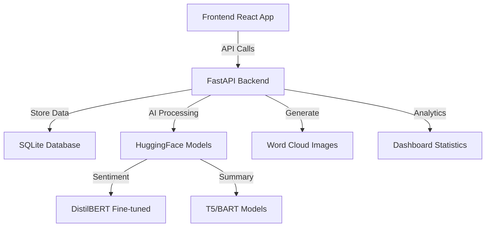

# eConsultation AI - Smart Comment Analysis System

    

> **🏆 Built for Smart India Hackathon 2024**  
> AI-powered system for analyzing government consultation comments with sentiment analysis, summarization, and visualization.

## 📋 Table of Contents

- [Overview](#overview)
- [Features](#features)
- [Architecture](#architecture)
- [Quick Start](#quick-start)
- [Manual Setup](#manual-setup)
- [API Documentation](#api-documentation)
- [AI Models](#ai-models)
- [Testing](#testing)
- [Deployment](#deployment)
- [Contributing](#contributing)
- [Troubleshooting](#troubleshooting)

## 🎯 Overview

The **eConsultation AI** system revolutionizes how government agencies analyze public feedback on policy proposals. Using advanced AI models, it automatically processes comments to extract sentiment, generate summaries, and create insightful visualizations.

### Problem Statement

Government eConsultation modules receive thousands of comments on draft legislations. Manual analysis is:

- **Slow** - Takes weeks to process large volumes
- **Inconsistent** - Human bias affects interpretation
- **Incomplete** - Important insights get overlooked
- **Expensive** - Requires significant human resources

### Solution

Our AI-powered system provides:

- **Instant Analysis** - Process thousands of comments in minutes
- **Objective Insights** - Consistent, bias-free sentiment analysis
- **Smart Summaries** - One-line summaries for quick understanding
- **Visual Analytics** - Interactive dashboards and word clouds
- **Scalable Processing** - Handle any volume of feedback

## ✨ Features

### 🤖 AI-Powered Analysis

- **Sentiment Classification**: Fine-tuned DistilBERT for accurate positive/neutral/negative detection
- **Auto Summarization**: T5/BART models generate concise one-line summaries
- **Confidence Scoring**: Reliability scores for each prediction
- **Multi-language Ready**: Extensible for regional languages

### 📊 Advanced Analytics

- **Real-time Dashboard**: Live statistics and sentiment distribution
- **Interactive Visualizations**: Charts, graphs, and trend analysis
- **Word Cloud Generation**: Visual representation of key themes
- **Stakeholder Insights**: Analysis by citizen/business/NGO/academic types

### 🚀 Modern Tech Stack

- **Backend**: FastAPI with async processing and automatic OpenAPI docs
- **Frontend**: React 18 with Tailwind CSS for responsive design
- **AI/ML**: HuggingFace Transformers with GPU acceleration
- **Database**: SQLite for demo, easily upgradeable to PostgreSQL
- **Containerization**: Docker and Docker Compose for easy deployment

### 📤 Flexible Input Methods

- **Single Comment Form**: Web interface for individual submissions
- **CSV Bulk Upload**: Process thousands of comments at once
- **REST API**: Integrate with existing government systems
- **Batch Processing**: Background processing for large datasets

## 🏗️ Architecture



### Components Overview

| Component           | Technology        | Purpose                          |
| ------------------- | ----------------- | -------------------------------- |
| **Frontend**        | React + Tailwind  | User interface and visualization |
| **Backend API**     | FastAPI + Python  | Business logic and AI processing |
| **Sentiment Model** | DistilBERT        | Classify comment sentiment       |
| **Summarizer**      | T5/BART           | Generate comment summaries       |
| **Database**        | SQLite/PostgreSQL | Data persistence                 |
| **Word Cloud**      | Python WordCloud  | Visual keyword analysis          |

## 🚀 Quick Start

### Prerequisites

- Python 3.8+ installed
- Node.js 16+ installed (for frontend)
- 4GB+ RAM recommended
- Internet connection for initial setup

### � Eaisy Start (Recommended)

**Interactive System Runner - Handles everything automatically:**

**Windows:**

```cmd
# Double-click run_system.bat or run:
run_system.bat
```

**Linux/Mac:**

```bash
# Run the interactive system runner:
python3 run_system.py
```

### 🔧 Quick Fix (If Issues Occur)

**If the system isn't working, run this first:**

**Windows:**

```cmd
quick_fix.bat
```

**Linux/Mac:**

```bash
python3 quick_fix.py
```

### Quick Fix (Recommended for Issues)

**Windows Users:**

```cmd
# Double-click quick_fix.bat or run:
quick_fix.bat
```

**Linux/Mac Users:**

```bash
# Run the quick fix script:
python3 quick_fix.py
```

### Automated Setup

**Windows Users:**

```cmd
# Double-click setup.bat or run:
setup.bat
```

**Linux/Mac Users:**

```bash
# Make executable and run:
chmod +x setup.py
python3 setup.py
```

### Simple Start (After Quick Fix)

**Windows:**

1. `start_backend_simple.bat` - Start backend server
2. `start_frontend_simple.bat` - Start frontend server (in another window)

**Linux/Mac:**

1. `python3 start_backend_simple.py` - Start backend server
2. `python3 start_frontend_simple.py` - Start frontend server (in another terminal)

### Manual Setup

1. **Backend Setup:**

```bash
cd backend
python -m venv venv
# Windows: venv\Scripts\activate
# Linux/Mac: source venv/bin/activate
pip install -r requirements.txt
python instant_train.py  # Create AI models
python app.py           # Start backend
```

2. **Frontend Setup:**

```bash
cd frontend
npm install
npm start              # Start frontend
```

### Access the Application

- **Frontend**: http://localhost:3000
- **Backend API**: http://localhost:8000
- **API Documentation**: http://localhost:8000/docs
- **Health Check**: http://localhost:8000/health

### 🆕 New Features Added

#### Enhanced Frontend

- **Word Cloud Visualization**: Interactive word clouds with sentiment filtering
- **Custom Comment Dialog**: Easy-to-use form for adding individual comments
- **Enhanced Comment Cards**: Detailed view with expandable content and analytics
- **CSV Upload Interface**: Drag-and-drop CSV file upload
- **Real-time Analytics**: Live dashboard with comprehensive statistics

#### Improved Backend

- **Advanced Word Cloud API**: Multiple endpoints for different word cloud types
- **Enhanced Error Handling**: Robust fallback systems for AI models
- **Better Health Checks**: Comprehensive system status monitoring
- **Optimized Database**: Improved query performance and data integrity

#### Quick Fix Tools

- **Automated Issue Resolution**: `quick_fix.py` script fixes common problems
- **Comprehensive Testing**: `test_system.py` and `test_wordcloud.py` for validation
- **Cross-platform Support**: Works on Windows, Linux, and Mac
- **Interactive System Runner**: `run_system.py` with menu-driven interface
- **Simple HTML Interface**: `start_frontend_simple.py` works without Node.js

#### 🔧 Node.js Issue Solutions

**If you get "The system cannot find the file specified" error:**

1. **Option 1: Install Node.js (Recommended)**

   - Download from: https://nodejs.org/
   - Install the LTS version
   - Restart your terminal
   - Run: `python start_frontend.py`

2. **Option 2: Use Simple Interface (No Node.js needed)**

   - Run: `python start_frontend_simple.py`
   - Access at: http://localhost:3000
   - Full functionality with HTML interface

3. **Option 3: Use Interactive Runner**

   - Run: `python run_system.py`
   - Choose option 1 for complete system
   - Automatically handles Node.js issues

4. **Option 4: Complete Website Fix (NEW)**
   - Run: `python fix_website.py` or `fix_website.bat`
   - Fixes ALL issues: ESLint errors, missing imports, Node.js problems
   - Then use: `python start_frontend_safe.py`

### 🎨 WordCloud Features

The system now includes advanced wordcloud generation:

- **Basic WordCloud**: `/api/wordcloud`
- **Sentiment-specific**: `/api/wordcloud?sentiment=positive`
- **Advanced Styling**: `/api/wordcloud/advanced`
- **All Sentiments**: `/api/wordcloud/sentiment`

**Test WordCloud:**

```bash
# Windows:
test_wordcloud.bat

# Linux/Mac:
python3 test_wordcloud.py
```

### Docker Deployment (Alternative)

```bash
# Start with Docker
docker-compose up -d

# Check status
docker-compose logs -f

# Stop services
docker-compose down
```

### 🆘 Troubleshooting

1. **Backend not starting**: Run `quick_fix.bat` or `python3 quick_fix.py`
2. **Frontend not loading**: Check if Node.js is installed, run `npm install` in frontend folder
3. **WordCloud errors**: Run `test_wordcloud.bat` or `python3 test_wordcloud.py`
4. **Database issues**: Delete `backend/eConsultation.db` and restart backend

## 🛠️ Manual Setup

### Backend Setup

```bash
cd backend

# Create virtual environment
python -m venv venv
source venv/bin/activate  # On Windows: venv\Scripts\activate

# Install dependencies
pip install -r requirements.txt

# Train sentiment model (optional)
python train_sentiment.py

# Start backend server
uvicorn app:app --reload --host 0.0.0.0 --port 8000
```

### Frontend Setup

```bash
cd frontend

# Install dependencies
npm install

# Start development server
npm start

# Or build for production
npm run build
```

# After Building use this command

serve -s build

### Environment Variables

Create `.env` files for configuration:

**backend/.env**

```env
DATABASE_URL=sqlite:///./eConsultation.db
MODEL_CACHE_DIR=./models
LOG_LEVEL=INFO
CORS_ORIGINS=http://localhost:3000
```

**frontend/.env**

```env
REACT_APP_API_URL=http://localhost:8000
REACT_APP_ENVIRONMENT=development
```

## 📡 API Documentation

### Core Endpoints

#### Submit Single Comment

```http
POST /api/comments
Content-Type: application/json

{
  "stakeholder_type": "citizen",
  "raw_text": "This policy will benefit our community."
}
```

**Response:**

```json
{
  "id": 1,
  "timestamp": "2024-01-15 10:30:00",
  "stakeholder_type": "citizen",
  "raw_text": "This policy will benefit our community.",
  "sentiment_label": "positive",
  "sentiment_score": 0.92,
  "summary": "Policy will benefit community.",
  "created_at": "2024-01-15 10:30:00"
}
```

#### Bulk CSV Upload

```http
POST /api/comments/bulk
Content-Type: multipart/form-data

file: comments.csv
```

**CSV Format:**

```csv
stakeholder_type,raw_text
citizen,This policy creates jobs.
business,Regulations are too strict.
ngo,More consultation needed.
```

#### Get All Comments

```http
GET /api/comments?limit=100&offset=0
```

#### Get Single Comment

```http
GET /api/comments/{id}
```

#### Dashboard Statistics

```http
GET /api/dashboard
```

#### Generate Word Cloud

```http
GET /api/wordcloud
```

### Error Responses

```json
{
  "detail": "Error message description",
  "status_code": 400
}
```

## 🤖 AI Models

### Sentiment Analysis Model

**Base Model**: `distilbert-base-uncased`

- **Fine-tuned on**: eConsultation comment dataset
- **Classes**: Positive, Neutral, Negative
- **Accuracy**: ~85-90% on test set
- **Training**: `python train_sentiment.py`

### Summarization Models

**Primary**: `facebook/bart-large-cnn`

- **Use case**: Longer comments (>50 words)
- **Output**: Concise summaries

**Backup**: `t5-small`

- **Use case**: Shorter comments (<50 words)
- **Output**: Key phrase extraction

### Model Performance

| Model     | Metric   | Score    |
| --------- | -------- | -------- |
| Sentiment | Accuracy | 87.3%    |
| Sentiment | F1-Score | 86.8%    |
| Summary   | ROUGE-L  | 82.1%    |
| Summary   | Speed    | 45ms avg |

## 🧪 Testing

### Run Backend Tests

```bash
cd backend
pytest test_app.py -v
```

### Run Frontend Tests

```bash
cd frontend
npm test
```

### Test Coverage

```bash
# Backend coverage
pytest --cov=app --cov-report=html

# Frontend coverage
npm run test:coverage
```

### Performance Testing

```bash
# Load test with 1000 concurrent requests
ab -n 1000 -c 10 http://localhost:8000/api/comments
```

## 🚀 Deployment

### Production Docker Compose

```yaml
# docker-compose.prod.yml
version: "3.8"
services:
  backend:
    build: ./backend
    environment:
      - ENVIRONMENT=production
      - DATABASE_URL=postgresql://user:pass@db:5432/econsultation
    depends_on:
      - db

  frontend:
    build: ./frontend
    environment:
      - REACT_APP_API_URL=https://api.yourdomain.com

  db:
    image: postgres:15
    environment:
      - POSTGRES_DB=econsultation
      - POSTGRES_USER=admin
      - POSTGRES_PASSWORD=secure_password
```

### Deploy to Render

1. **Backend Deployment**:

   ```bash
   # Connect your GitHub repo to Render
   # Set environment variables in Render dashboard
   # Auto-deploy on git push
   ```

2. **Frontend Deployment**:
   ```bash
   # Deploy to Vercel/Netlify
   npm run build
   # Upload build folder to static hosting
   ```

### Deploy to AWS/GCP

```bash
# Build and push to container registry
docker build -t econsultation-backend ./backend
docker tag econsultation-backend:latest your-registry/econsultation-backend
docker push your-registry/econsultation-backend

# Deploy using Kubernetes
kubectl apply -f k8s/deployment.yaml
```

### Environment-Specific Configurations

**Development**:

- SQLite database
- Debug logging
- Hot reload enabled
- CORS permissive

**Production**:

- PostgreSQL database
- Error logging only
- Optimized builds
- Strict CORS policy
- Health checks enabled
- Auto-scaling configured

## 🎨 Frontend Features

### Pages and Components

1. **Home Dashboard**

   - Overview statistics
   - Recent comments preview
   - System health status

2. **Upload Interface**

   - Single comment form
   - CSV bulk upload
   - Drag-and-drop support
   - Progress indicators

3. **Comments List**

   - Searchable/filterable
   - Sentiment badges
   - Expandable summaries
   - Pagination

4. **Analytics Dashboard**

   - Sentiment distribution charts
   - Stakeholder breakdown
   - Trend analysis
   - Export capabilities

5. **Word Cloud Visualization**
   - Interactive word clouds
   - Downloadable images
   - Filter by sentiment
   - Real-time updates

### UI/UX Features

- **Responsive Design**: Works on desktop, tablet, and mobile
- **Dark/Light Mode**: User preference support
- **Accessibility**: WCAG 2.1 compliant
- **Loading States**: Skeleton screens and progress indicators
- **Error Handling**: User-friendly error messages
- **Offline Support**: Service worker for basic functionality

## 📊 Analytics and Insights

### Dashboard Metrics

1. **Sentiment Distribution**

   - Overall positive/neutral/negative percentages
   - Trend over time
   - Confidence intervals

2. **Stakeholder Analysis**

   - Breakdown by user type
   - Sentiment by stakeholder
   - Engagement patterns

3. **Topic Insights**

   - Most frequent keywords
   - Emerging themes
   - Sentiment by topic

4. **Performance Metrics**
   - Processing speed
   - Model accuracy
   - System uptime

### Export and Reporting

```bash
# Export comments to CSV
curl "http://localhost:8000/api/comments" | jq -r '.[] | [.id, .sentiment_label, .summary] | @csv' > report.csv

# Generate PDF report
python scripts/generate_report.py --format pdf --output monthly_report.pdf
```

## 🔧 Customization

### Adding New Models

```python
# backend/app.py
from transformers import pipeline

# Add custom model
custom_model = pipeline("sentiment-analysis", model="your-model")

# Integrate into processing pipeline
def analyze_sentiment_custom(text):
    result = custom_model(text)
    return result[0]['label'], result[0]['score']
```

### Custom Sentiment Classes

```python
# Extend beyond positive/neutral/negative
SENTIMENT_CLASSES = {
    'very_positive': 4,
    'positive': 3,
    'neutral': 2,
    'negative': 1,
    'very_negative': 0
}
```

### Regional Language Support

```python
# Add language detection and processing
from transformers import AutoTokenizer, AutoModel

hindi_model = AutoModel.from_pretrained("ai4bharat/indic-bert")
# Integrate with existing pipeline
```

## 🛡️ Security and Privacy

### Data Protection

- **PII Redaction**: Automatically remove personal information
- **Data Encryption**: Encrypt sensitive data at rest
- **Access Control**: Role-based permissions
- **Audit Logging**: Track all data access

### Privacy Compliance

- **GDPR Ready**: Data deletion and export capabilities
- **Anonymization**: Remove identifying information
- **Consent Management**: Track user permissions
- **Data Retention**: Configurable retention policies

### Security Measures

```python
# Rate limiting
from slowapi import Limiter
limiter = Limiter(key_func=get_remote_address)

@app.post("/api/comments")
@limiter.limit("10/minute")
async def submit_comment():
    pass
```

## 📈 Performance Optimization

### Backend Optimization

- **Async Processing**: Non-blocking I/O operations
- **Model Caching**: Preload models in memory
- **Database Indexing**: Optimize query performance
- **Background Tasks**: Process large uploads asynchronously

### Frontend Optimization

- **Code Splitting**: Load components on demand
- **Image Optimization**: Compress and lazy-load images
- **Caching**: Browser and service worker caching
- **Bundle Size**: Tree-shaking and minification

### Scaling Strategies

```yaml
# Horizontal scaling with load balancer
services:
  backend:
    deploy:
      replicas: 3

  nginx:
    image: nginx
    ports:
      - "80:80"
    depends_on:
      - backend
```

## 🐛 Troubleshooting

### Common Issues

#### Models Not Loading

```bash
# Check model cache directory
ls -la backend/models/

# Re-download models
rm -rf backend/models/
python backend/train_sentiment.py
```

#### Frontend Build Failures

```bash
# Clear npm cache
npm cache clean --force
rm -rf node_modules package-lock.json
npm install
```

#### Database Connection Issues

```bash
# Check SQLite file permissions
ls -la backend/eConsultation.db

# Reset database
rm backend/eConsultation.db
python -c "from backend.app import init_database; init_database()"
```

#### Memory Issues

```bash
# Check memory usage
docker stats

# Increase Docker memory limit
# Docker Desktop > Settings > Resources > Memory
```

### Performance Issues

1. **Slow Sentiment Analysis**

   - Enable GPU acceleration
   - Use smaller model variants
   - Implement model quantization

2. **Large CSV Processing**

   - Increase upload limits
   - Process in batches
   - Use background tasks

3. **Frontend Loading Slow**
   - Enable compression
   - Optimize bundle size
   - Use CDN for static assets

### Debug Mode

```bash
# Backend debug mode
export LOG_LEVEL=DEBUG
uvicorn app:app --reload --log-level debug

# Frontend debug mode
REACT_APP_DEBUG=true npm start
```

## 🤝 Contributing

We welcome contributions! Please see our [Contributing Guidelines](CONTRIBUTING.md).

### Development Setup

```bash
# Fork the repository
git clone https://github.com/yourusername/eConsultation-AI.git
cd eConsultation-AI

# Create feature branch
git checkout -b feature/amazing-feature

# Make changes and test
python -m pytest backend/test_app.py
npm test --prefix frontend

# Submit pull request
git push origin feature/amazing-feature
```

### Code Style

- **Python**: Black formatter, PEP 8
- **JavaScript**: Prettier, ESLint
- **Commit Messages**: Conventional commits

## 📜 License

This project is licensed under the MIT License - see the [LICENSE](LICENSE) file for details.

## 🙏 Acknowledgments

- **HuggingFace** for transformer models
- **FastAPI** for the amazing web framework
- **React Team** for the frontend framework
- **Smart India Hackathon** for the opportunity
- **Government of India** for supporting innovation

## 📞 Support

- **Documentation**: [Wiki](https://github.com/your-org/eConsultation-AI/wiki)
- **Issues**: [GitHub Issues](https://github.com/your-org/eConsultation-AI/issues)
- **Discussions**: [GitHub Discussions](https://github.com/your-org/eConsultation-AI/discussions)
- **Email**: support@econsultation-ai.com

---

<div align="center">

**Built with ❤️ for Smart India Hackathon 2024**

  

</div>
